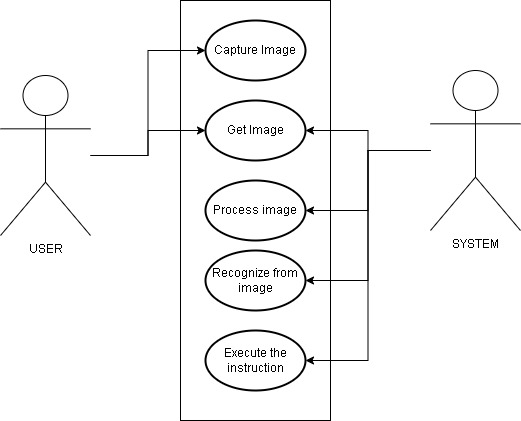

# Membuat switch nirsentuh menggunakan Arduino dan sensor PIR
Kelompok 8 terdiri dari 2 anggota yaitu: 
 - Farhan Alwahid | 105220020
 - Muhammad Alfaridza Maulana | 105220051

### Table of contents
1. [Main Project Details](#project)
    1. [Problem Statement](#prob)
    2. [Proposed solution](#sol)
    3. [Use Case diagram](#uc)

<br/>

# Main Project: Membuat switch nirsentuh menggunakan Arduino dan sensor PIR <a name="project"></a>

### Problem Statement <a name="prob"></a>

```
Salah satu permasalahan yang sering dihadapi di kehidupan sehari-hari adalah kesulitan untuk mengontrol perangkat elektronik tanpa menyentuhnya.

Misalnya, untuk menyalakan lampu atau membuka pintu, kita harus menyentuh tombol atau gagang.

Hal ini dapat menjadi masalah bagi orang-orang yang memiliki keterbatasan fisik atau yang ingin menjaga kebersihan.
```

<br/>

### Our Solution <a name="sol"></a>
Solusi yang dapat ditawarkan adalah dengan menggunakan Membuat switch nirsentuh menggunakan Arduino dan sensor PIR. Switch ini menggunakan sensor untuk mendeteksi gerakan tangan dan mengubahnya menjadi perintah untuk mengontrol perangkat elektronik.

<br/>

### Use case diagram <a name="uc"></a>


